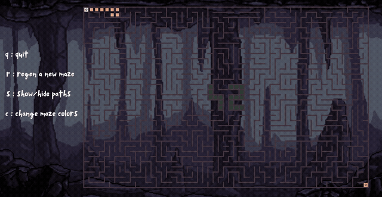
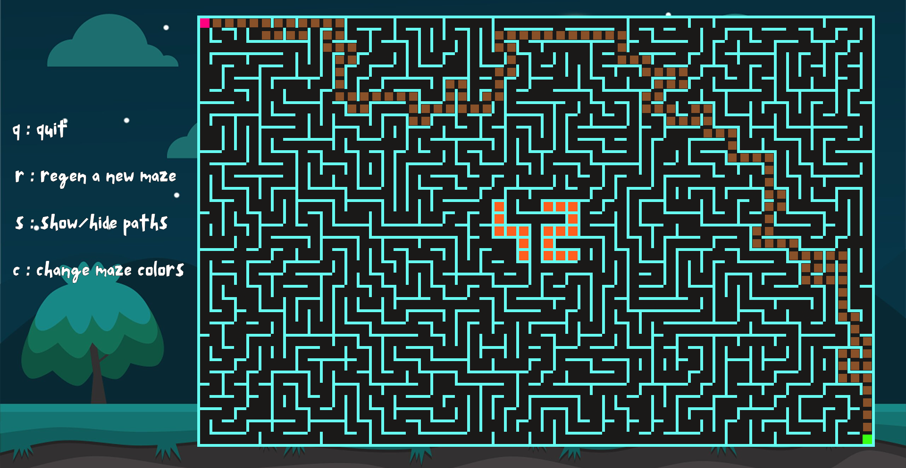
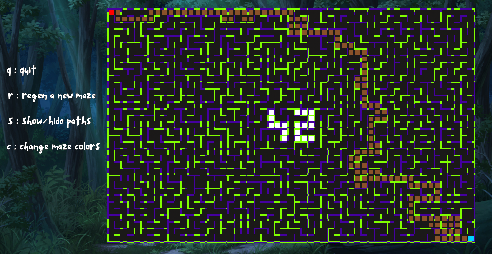
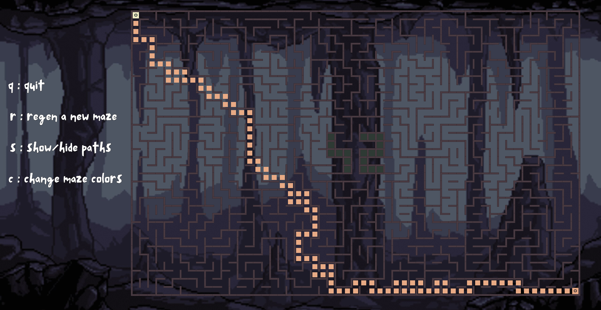

*This activity has been created as part of the 42 curriculum by naldibis, labdalla.*

# A_maze_ing

A configurable maze generator, solver and visualizer written in Python. The program reads its parameters from a plain-text configuration file, generates a maze of the requested dimensions, computes the shortest path between the entry and the exit, writes the result to a text file, and renders the whole thing in a graphical window using the MLX library. Every maze has the 42 logo carved into its center, and the shortest path is animated tile by tile across three color themes.

---

## Preview



<p align="center">
  
  
  
</p>

---

## Description

The goal of the project is to build a complete maze pipeline, from configuration to visual output, while keeping each stage independent from the others.

The program is split into four stages that communicate through well-defined data rather than shared state:

1. **Configuration** — reads and validates `config.txt`, exposing every setting through a single `Configuration` class.
2. **Generation** — builds a maze with an iterative depth-first search with backtracking, then optionally braids it into an imperfect maze.
3. **Solving** — finds the shortest path from entry to exit with a breadth-first search and encodes it as a string of cardinal moves.
4. **Display** — renders the maze, the entry and exit markers, the solution path and the on-screen controls in an MLX window.

Two details are worth pointing out:

- Every maze large enough (at least 9x9) has the **"42" symbol carved into its center**. Those cells are locked before generation starts and are never touched again, so the symbol survives both the DFS carving pass and the braiding pass.
- The maze is stored in a **compact hexadecimal format**, one character per cell, which makes the output file readable by any other program without needing to know anything about our internal classes.

### Maze output format

The generator writes the maze as a grid of hexadecimal digits. Each cell is a 4-bit mask of its walls, where a bit set to `1` means the wall is present:

| Wall  | Bit | Value |
|-------|-----|-------|
| North | 0   | 1     |
| East  | 1   | 2     |
| South | 2   | 4     |
| West  | 3   | 8     |

A cell with value `9` (`1001`) therefore has its north and west walls standing, and is open to the east and south. `F` is a fully closed cell, `0` a fully open one.

The output file produced by a run looks like this:

```
9139139153
A86A846A96
AC568156C3
83F906FFFA
AAFC4157FA
AAFFFAFFFA
C413FAFD52
956AFAFFFA
A952903952
C45446C456

0, 0
9, 9
SSSESSSEESSSEENESEEE
```

The grid is followed by a blank line, the entry point, the exit point, and the solution path encoded as a string of `N`, `E`, `S`, `W` moves.

---

## Instructions

### Requirements

- Python 3.10 or later.
- Two wheels, both shipped with the repository:
  - `mlx-2.2-py3-none-any.whl`, the graphics library provided by 42.
  - `mazegen-1.0.0-py3-none-any.whl`, our own maze generator, built from `maze_generation.py` through `setup.py`.

### Installation and execution

```bash
make run        # installs if needed, then runs the program
```

Or manually:

```bash
pip install mlx-2.2-py3-none-any.whl
pip install mazegen-1.0.0-py3-none-any.whl
python3 a_maze_ing.py config.txt
```

The program takes exactly one argument and it must be `config.txt`. Any other invocation prints the usage line and exits.

### Available make targets

| Target        | Effect                                                                 |
|---------------|------------------------------------------------------------------------|
| `install`     | Installs the MLX wheel and the `mazegen` wheel                          |
| `run`         | Installs the wheel then runs the program on `config.txt`                |
| `debug`       | Runs the program under `pdb`                                            |
| `clean`       | Removes `__pycache__` directories and the mypy cache                    |
| `lint`        | Runs `flake8`, then `mypy` with untyped-definition and return checks    |
| `lint-strict` | Runs `flake8`, then `mypy --strict`                                     |

### Controls

Once the window is open:

| Key | Action                                  |
|-----|------------------------------------------|
| `Q` | Quit and close the window               |
| `R` | Regenerate a new maze and solve it      |
| `S` | Show or hide the solution path          |
| `C` | Cycle through the three color themes    |

Both lower and upper case are accepted.

---

## Configuration file

The configuration file is a list of `KEY = VALUE` pairs, one per line. Empty lines are ignored, and any line starting with `#` is treated as a comment. Spaces around the `=` sign are stripped, so `WIDTH=10` and `WIDTH = 10` are equivalent.

```
# Default Config.txt
WIDTH = 10
HEIGHT = 10
ENTRY = 0,0
EXIT = 9,9
OUTPUT_FILE = maze.txt
PERFECT = False
# You can either enter a seed as an int value or leave it blank or
# zero to have a different maze every time you regenerate
SEED = 0
```

### Keys

| Key           | Type            | Constraints                                                              |
|---------------|-----------------|----------------------------------------------------------------------------|
| `WIDTH`       | integer         | Between 1 and 55 inclusive                                                |
| `HEIGHT`      | integer         | Between 1 and 35 inclusive                                                |
| `ENTRY`       | `x,y` integers  | Must be inside the grid, and must differ from `EXIT`                      |
| `EXIT`        | `x,y` integers  | Must be inside the grid, and must differ from `ENTRY`                     |
| `OUTPUT_FILE` | string          | Path of the file the maze is written to                                   |
| `PERFECT`     | `True`/`False`  | `True` yields a perfect maze, `False` braids it into an imperfect one     |
| `SEED`        | integer         | A non-zero value makes generation reproducible; `0` randomizes every run  |

The upper bounds on `WIDTH` and `HEIGHT` are not arbitrary. Each cell is drawn as a 26x26 pixel tile inside a 1920x1080 window, so 55x35 is the largest grid that still fits on a 42 workstation screen alongside the controls panel.

Coordinates follow the `x,y` convention where `x` is the column and `y` is the row, both zero-based and counted from the top-left corner.

### Validation

The configuration is rejected, with an explicit message, when:

- a line is not a well-formed `KEY = VALUE` pair;
- the same key appears twice;
- fewer than six recognized keys are present;
- `PERFECT` holds anything other than `True` or `False`;
- `WIDTH` or `HEIGHT` is not a positive integer, or exceeds its maximum;
- `ENTRY` or `EXIT` falls outside the grid;
- `ENTRY` and `EXIT` are the same cell;
- `ENTRY` or `EXIT` lands on a cell reserved for the "42" symbol.

---

## Reusability

The reusable component is **`maze_generator.py`**, which holds the `Cell` and `MazeGenerator` classes. It's a standalone module — no imports from `configuration`, `algorithm` or `graphical_display`, every parameter passed through the constructor, no file/screen/global-state access. To enforce that independence, it's built and distributed as its own wheel (`mazegen-1.0.0-py3-none-any.whl`), consumed by the rest of the project through a plain `import` like any third-party package.

```python
from mazegen import MazeGenerator

generator = MazeGenerator(width=55, height=35, entry={"x": 0, "y": 0}, exit={"x": 54, "y": 34}, perfect=False, seed=1)
maze = generator.generate_paths(seed=1)   # returns the grid as list[list[Cell]]
generator.maze_output("output.txt")       # writes the hexadecimal representation
```

Running `python3 maze_generator.py` directly generates a 55x35 maze and writes it to `output.txt`, so the module is testable without launching the graphical window.

---

## Project structure

```
.
├── a_maze_ing.py                    Entry point, argument handling, orchestration
├── maze_generation/                 Standalone reusable module: Cell, MazeGenerator
│   ├── maze_generator.py
│   ├── __init__.py         
├── setup.py                         Packaging metadata for the mazegen wheel
├── Makefile
├── LICENSE.md                       MIT license
├── config.txt                       Default configuration
├── mlx-2.2-py3-none-any.whl
├── mazegen-1.0.0-py3-none-any.whl   Built distribution of maze_generation.py
├── configuration/
│   ├── __init__.py            Exports Configuration and ConfigError
│   ├── configuration.py       Configuration class, loading and validation
│   └── configuration_utils.py Parsing, type conversion, bounds checking
├── algorithm/
│   ├── __init__.py            Exports run
│   └── find_paths.py          BFS solver and the run() orchestrator
├── graphical_display/
│   ├── __init__.py            Exports display_output
│   ├── display.py             MLX window, rendering, key hooks
│   └── display_utils.py       Theme and control image tables
├── images/
│   ├── first_set/             Theme 1 tiles
│   ├── second_set/            Theme 2 tiles
│   ├── third_set/             Theme 3 tiles
│   └── controls/              On-screen control legend
└── assets/                    README media: demo gif and theme screenshots
```

---

## Team and project management

### Roles

| Member     | Responsibility                                                                 |
|------------|-----------------------------------------------------------------------------------|
| `labdalla` | Configuration system: file parsing, type conversion, validation rules, error handling |
| `naldibis` | Pathfinding: the BFS solver, path reconstruction and the move-string encoding    |

Everything else, including the maze generation algorithm, the "42" symbol, the braiding pass, the graphical display, the themes, the keyboard controls and the tooling, was written jointly.

### What could be improved

- **Image loading is not cached.** Every redraw re-reads each PNG from disk through `mlx_png_file_to_image`, which is noticeably slow on large mazes. Loading each tile once into a dictionary at startup would fix it.
- **There are no automated tests.** Verification was done by inspection and by eye. A small test suite over the generator and the solver, using fixed seeds, would have been cheap to write and would have caught regressions faster.

### Tools

- **Git and GitHub** — feature branches, pull requests and code review between the two of us.
- **MLX** — the graphics library used for the window and image rendering.
- **flake8** — style and lint checking, enforced through `make lint`.
- **mypy** — static type checking, including a `--strict` target.
- **pdb** — interactive debugging through `make debug`.
- **Make** — a single entry point for installing, running, cleaning and checking the project.
- **setuptools and build** — used to package the generator into the `mazegen` wheel from `setup.py`.

---

## Resources

### Maze generation and pathfinding

- Wikipedia, *Maze generation algorithm*: <https://en.wikipedia.org/wiki/Maze_generation_algorithm>
- Wikipedia, *Breadth-first search*: <https://en.wikipedia.org/wiki/Breadth-first_search>
- Youtube, *Create Wheel Files in Python*: <https://www.youtube.com/watch?v=AM2dgUAdwaQ>

### Use of AI

AI was only used to generate this README.md file, help with docstrings and give resources.

---

## License

This project is released under the MIT License. See [LICENSE.md](LICENSE.md).
